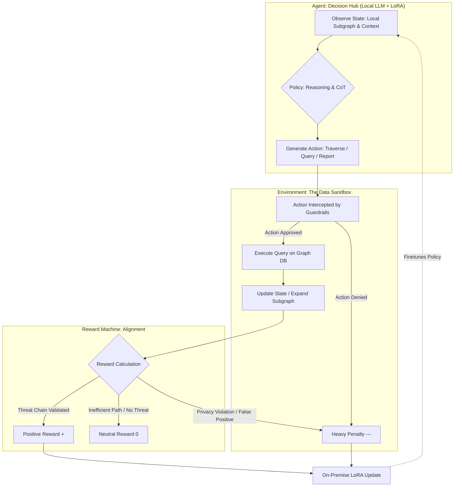

# Project Sentinel-KG: Guardrailed AI Agents for National Security Knowledge Graph Traversal

## 1. Executive Summary

Project Sentinel-KG proposes an autonomous, multi-agent reasoning system for the Swedish government, integrating data from Skatteverket (Tax Agency), Försäkringskassan (Social Insurance Agency), Arbetsförmedlingen (Employment Agency), and Bolagsverket (Companies Registration Authority). The system deploys LLM agents to traverse a national security Knowledge Graph (KG), identifying threats such as economic crime, money laundering, terrorism financing, and foreign interference in critical infrastructure.

The system also interfaces with **CyberSecurity AB**, a private company that operates an international threat-intelligence KG built from open-source intelligence (OSINT). This creates a **dual-system architecture** — one sovereign, one commercial — that demands careful engineering of data boundaries, trust hierarchies, and integration protocols.

Inspired by the **Atlantis Cyber Reasoning System** (DARPA AIxCC), Sentinel-KG adapts proven techniques from automated vulnerability discovery — reinforcement learning, multi-agent ensembles, sandboxed execution, and anti-hallucination validation — to the fundamentally different domain of national security threat hunting. The core architectural insight: **model threat traversal as an RL problem** where agents learn to navigate a knowledge graph under strict privacy constraints, just as Atlantis agents learn to navigate codebases under correctness constraints.

To comply with GDPR, the Swedish Protective Security Act (*Säkerhetsskyddslagen* 2018:585), and the EU AI Act's requirements for high-risk systems, the entire pipeline runs **on-premise in an air-gapped environment** using locally hosted open-source models.

---

## 2. Background: Why This Architecture Fits the Swedish Context

### 2.1 The Problem

Sweden faces an evolving threat landscape — hybrid warfare, foreign economic espionage, and sophisticated financial crime — that outpaces the capacity of manual, linear database queries across siloed agency systems. Connecting the dots across tax records, employment data, social insurance claims, and corporate registries requires **multi-hop graph traversal** at a scale and speed that human analysts cannot sustain.

At the same time, Sweden's democratic tradition places strict limits on government surveillance. The **IB affair** (1973) — the exposure of a secret intelligence registry targeting union members and political activists — remains a defining moment in Swedish civil liberties discourse. The **FRA-lagen** debate (2008) over signals intelligence legislation showed that even legally authorized surveillance powers face intense public resistance. Any AI system touching citizen data must be engineered to earn, not assume, public trust.

### 2.2 The Dual-System Challenge

The policy task requires governing **two distinct systems** and their interaction:

| | Sovereign KG (Government) | International KG (CyberSecurity AB) |
|---|---|---|
| **Data sources** | Tax, employment, social insurance, corporate registries | OSINT: social media, public records, global threat feeds |
| **Scope** | Swedish entities | Global actors and targets |
| **Ownership** | Swedish state | Private company, multiple nation-state clients |
| **Control** | Full | Contractual only |
| **Trust level** | Trusted (internal) | Untrusted (external) |

The fundamental asymmetry: CyberSecurity AB serves multiple countries simultaneously. Sweden cannot know what other nations are querying, nor whether AB's other clients have adversarial interests. This shapes every integration decision.

### 2.3 Legal Constraints as Engineering Requirements

Rather than treating legal compliance as an afterthought, Sentinel-KG encodes legal constraints directly into the system architecture:

| Legal requirement | Engineering implementation |
|---|---|
| **GDPR data minimization** (Art. 5(1)(c)) | Agent state is a *semantic window* — localized subgraph, not full database access |
| **GDPR purpose limitation** (Art. 5(1)(b)) | Action space is strictly bounded; each query must declare its investigation context |
| **Säkerhetsskyddslagen** security classification | `request_clearance(level)` action requires human approval for classified data layers |
| **EU AI Act** high-risk system requirements | Full audit trail of every agent action, state transition, and operator decision |
| **Offentlighetsprincipen** (public access principle) | Governance architecture supports declassified audit summaries for public accountability |

---

## 3. Technical Architecture: The RL Pipeline

### 3.1 Design Philosophy — From Atlantis to Sentinel-KG

The Atlantis CRS (Team Atlanta, DARPA AIxCC) demonstrated that **modeling a search problem as reinforcement learning** produces agents that outperform rigid rule-based systems. Atlantis agents navigate codebases to discover, analyze, and patch vulnerabilities using an RL loop: observe state → generate action → receive reward → update policy.

Sentinel-KG borrows this structural pattern — the RL loop, the sandboxed environment, the multi-agent ensemble — but the transfer is **not straightforward**. The two domains differ in ways that fundamentally affect what RL can and cannot do:

| | Atlantis (Code Graphs) | Sentinel-KG (Social/Financial Graphs) |
|---|---|---|
| **Edge semantics** | Deterministic. A function either calls another function or it does not. | Ambiguous. A "relationship" between two people could be a joint bank account, a decade-old employment record, or a coincidental shared address. Every edge carries **interpretive burden**. |
| **State observability** | Fully observable within the sandbox. Source code, call graphs, and crash logs are complete and precise. | Partially observable. Agency data is incomplete, temporally inconsistent, and shaped by what each agency chose to record. |
| **Reward signal** | Objective and verifiable. A vulnerability either exists or it does not. A patch either compiles and passes tests, or it does not. Ground truth is cheap. | **Fundamentally subjective.** Whether a pattern constitutes a "threat" depends on context, intent, and legal interpretation. Ground truth requires completed human investigations — expensive, slow, and biased by the original investigator's assumptions. |
| **Error consequences** | A false positive wastes compute. A false negative misses a bug. | A false positive triggers an investigation into an innocent person. The cost is asymmetric and irreversible in ways that code analysis never is. |

**What we take from Atlantis — and what we cannot.**

We take the **structural patterns**: the RL loop architecture, the sandboxed read-only environment (adapted from VFS), the multi-agent ensemble (GRPO), the anti-hallucination validation (`action_from_completion()`), and LoRA hot-swap for rapid adaptation. These are domain-agnostic engineering patterns that work regardless of what the graph represents.

We **cannot take** the assumption that the reward signal is objective. In Atlantis, `reward = vulnerability_confirmed + patch_compiles + tests_pass` is a ground-truth signal that requires no human judgment. In Sentinel-KG, `Threat_Confidence` is ultimately derived from human-labeled historical cases — and those labels carry the biases of the investigators who produced them. This means:

- The RL pipeline cannot be a fully autonomous learning loop. It requires **periodic human audit of the training signal itself** — not just the agent's outputs, but the labeled cases the reward function is trained on.
- The reward function should be understood as encoding **institutional judgment** (what past investigators considered threatening), not objective truth. When institutional judgment is biased — e.g., disproportionately investigating certain demographics — the RL pipeline will amplify that bias unless explicitly corrected.
- The $\gamma$ privacy penalty is the one component of the reward function that *can* be objective (did the agent access data outside the investigation scope? yes/no), which is why it is the strongest lever we have.

This honest framing matters: Sentinel-KG is not "Atlantis but for national security." It is an adaptation of Atlantis's engineering patterns to a domain where the reward signal is weaker, the edges are ambiguous, and the stakes for individuals are higher. The governance layers (§4–§6) exist precisely because the RL pipeline alone cannot carry the weight that it carries in Atlantis.

The structural mapping, for reference:

| Atlantis | Sentinel-KG | Transfer quality |
|---|---|---|
| State: code context + call graph + crash log | State: local subgraph + entity context + query history | Good — structural parallel |
| Action: navigate code, run tools, generate patches | Action: traverse nodes, request clearance, submit evidence | Good — P4 protocol adapts cleanly |
| Environment: Docker sandbox, compile & test | Environment: read-only KG sandbox, guardrail checks | Good — VFS pattern transfers directly |
| Reward: vulnerability found + patch compiles + tests pass | Reward: threat confidence + efficiency − privacy penalty | **Weak** — objective → subjective signal |
| Safety: VFS overlay prevents disk writes | Safety: read-only layer prevents record modification | Good — structural guarantee |
| Anti-hallucination: symbols must exist in source prompt | Anti-hallucination: evidence must map to real DB entries | Good — validation pattern transfers |

### 3.2 Architecture Overview



### 3.3 Pipeline Breakdown

**1. State (Observation)**

The agent does not see the entire national database. Its state is a **semantic window**: a localized subgraph containing the current entity under investigation, filtered connections based on the investigation type (see §3.5 for the windowing mechanism and its limitations), and the history of the agent's previous queries. This mirrors Atlantis's approach where the P4 environment provides an accumulating observation set — `new_documents | existing_observation` — rather than full codebase access. The critical difference: in Atlantis, the observation boundary is defined by what tools have been run (deterministic). In Sentinel-KG, the window boundary determines which relationships the agent can even see — making the windowing mechanism a first-order architectural decision with direct impact on what threats can and cannot be detected.

**2. Action Space**

The agent's actions are strictly defined by a protocol adapted from Atlantis's P4 framework, where actions are typed and validated before execution:

- `explore_node(entity_id)` — Move to a connected node. The entity type and relationship type must be within the authorized scope.
- `request_clearance(level)` — Ask for human approval to access classified or sensitive data layers. Maps directly to Sweden's security classification tiers.
- `submit_evidence_bundle()` — Conclude the investigation and report a potential threat. The bundle must pass anti-hallucination validation before reaching any operator.

**3. Environment (The Guardrailed Sandbox)**

Agents operate in a **read-only, simulated layer** — analogous to Atlantis's Virtual File System (VFS) overlay, which intercepts all file operations and prevents writes to the real filesystem. In Sentinel-KG, the sandbox intercepts all graph queries and prevents agents from altering government records, triggering enforcement actions, or accessing data beyond their authorized scope.

**4. The Reward Function**

The RL reward function encodes the balance between security effectiveness and privacy protection:

$$Reward = (\alpha \times \text{Threat\_Confidence}) + (\beta \times \text{Efficiency}) - (\gamma \times \text{Privacy\_Invasion\_Penalty})$$

The three terms are not created equal in terms of signal quality:

- **$\gamma$ (Privacy Invasion Penalty)** is the strongest signal. "Did the agent access data outside the authorized investigation scope?" is a binary, objective question. This is the one component that behaves like Atlantis's compile-or-not reward.
- **$\beta$ (Efficiency)** is measurable: hop count, time spent, nodes visited. Noisy but objective.
- **$\alpha$ (Threat Confidence)** is the weakest signal and the hardest problem. It is ultimately grounded in **human-labeled historical cases**: past investigations where analysts concluded "this was a real threat" or "this was benign." Those labels inherit the biases of the original investigators — if past practice disproportionately flagged certain demographics, the reward function learns to replicate that pattern. This is not a fixable bug; it is a structural property of learning from human judgment.

Mitigations for the reward signal problem:
- **Bias auditing of training data**: Before any historical case enters the reward training set, it is checked against the G5 disproportion detector (§5.2). Cases from investigation campaigns known to be biased are excluded or down-weighted.
- **Reward decomposition**: The three terms are tracked and reported separately. If $\alpha$ drives most of the reward while $\gamma$ is near zero, the agent is learning threat patterns but not being tested on privacy — a sign the training distribution needs rebalancing.
- **Conservative calibration**: $\gamma$ is calibrated to massively outweigh $\alpha$ when the agent accesses unrelated personal data. This means the system defaults to **under-investigating rather than over-investigating** when the threat signal is ambiguous — a deliberate asymmetry reflecting the irreversible cost of false positives on individuals.

### 3.4 Key Technologies

**On-Premise Local LLMs.** Data sovereignty is non-negotiable. The system uses locally hosted open-source models (e.g., Llama-3, Mistral) on government infrastructure. No data leaves the government's intranet. This mirrors Atlantis's air-gapped deployment on Azure AKS with private endpoints and Cloud NAT.

**LoRA (Low-Rank Adaptation).** Adapted from Atlantis's dynamic LoRA mechanism (P4 `BaseClient.enabled()`), which trains small adapter layers on vulnerability-specific context and hot-swaps them into vLLM at inference time. In Sentinel-KG, when new privacy regulations are enacted or new threat patterns emerge, a LoRA adapter is trained on the updated context and deployed without full model retraining.

**A critical caveat on LoRA stability.** In Atlantis, the risk of LoRA adaptation is contained: the test environment is closed, and the verification pipeline (compile → test → POV replay) catches regressions objectively. If a LoRA adapter degrades performance, the three-stage patch verification catches it before submission.

In Sentinel-KG, this safety net does not exist in the same form. A LoRA adapter trained for a new anti-money-laundering regulation changes the model's reasoning behavior globally — it may improve performance on financial crime scenarios while subtly degrading judgment on unrelated threat types (e.g., terrorism financing, foreign interference). These cross-domain effects are **non-obvious and hard to test**, because unlike Atlantis, there is no automated oracle that tells you whether the agent's reasoning on a real case is correct.

Mitigations:
- **Regression test suite**: Before any LoRA adapter is deployed to production, it must pass a battery of **held-out historical cases** spanning all threat categories, not just the category the adapter was trained on. Performance degradation on any category beyond a threshold blocks deployment.
- **Shadow mode**: New adapters run in parallel with the existing model for a burn-in period. Their outputs are logged and compared but do not reach operators. Divergence analysis reveals unexpected behavioral shifts before they affect real decisions.
- **Adapter isolation**: Where possible, LoRA adapters are scoped to specific investigation types (financial crime, infrastructure threats, etc.) and activated only when the agent is working in that domain, rather than applied globally. This limits cross-domain contamination, at the cost of increased operational complexity.
- **Rollback capability**: Every adapter deployment is versioned. If post-deployment monitoring (§6) detects performance anomalies, the system reverts to the previous adapter within minutes.

**GRPO (Group Relative Policy Optimization).** Atlantis deploys 4 nodes with different LLM agent combinations working on the same vulnerability in parallel, scored relative to each other. Sentinel-KG applies the same principle: multiple agents investigate the same anomaly simultaneously. They are scored relative to each other via GRPO, rapidly optimizing traversal strategy without requiring a complex critic model. Critically, **divergent conclusions between agents are flagged for human review** — if agents disagree on whether an entity is a threat, the system escalates rather than averaging.

### 3.5 The Hard Problem: Graph Scale and Entity Disambiguation

The technical architecture above assumes a functioning, unified knowledge graph. Building that graph is itself a major engineering challenge that should not be understated.

**Scale.** The sovereign KG integrates data from four agencies covering ~10 million individuals, ~1.5 million registered companies, and their financial, employment, insurance, and corporate relationships. A conservative estimate: **hundreds of millions of nodes** (entities + transactions + events) and **billions of edges** (relationships). Multi-hop traversal on a graph this size — where an agent may need to explore 3-5 hops from a starting entity — produces combinatorial explosion. A node with average degree 50 yields ~312 million reachable nodes at 5 hops.

This is why the **semantic window** is not just a privacy feature but a computational necessity. But calling it a "semantic window" is giving a name to a problem, not a solution. The critical question is: **who decides the window boundary, and how?**

The window boundary is the decision that determines which parts of the graph the agent can see. It is, in effect, the first and most consequential filter in the entire system — it decides what gets investigated and what is invisible. Three possible mechanisms, each with distinct failure modes:

**Option A: Fixed-hop boundary.** The simplest approach: starting from a seed entity, extract all nodes within *k* hops (e.g., k=3). This is deterministic, auditable, and computationally bounded. But it is semantically blind — 3 hops from a suspect includes their doctor, their children's school, and their neighbor's employer. The agent wastes traversal budget on noise, and the $\gamma$ penalty must do all the work of steering away from irrelevant paths. Worse, a fixed hop count may be too narrow for sprawling corporate ownership chains (which routinely involve 5+ shell company layers) and too wide for dense social clusters.

**Option B: Relationship-type filtering.** The environment pre-filters edges by type: for a financial crime investigation, only financial relationships (transactions, account co-ownership, corporate directorship) are included in the window; personal relationships (family, address, employment) are excluded by default and require `request_clearance()` to access. This is more targeted, but it requires a **predefined ontology of relationship types** — and the boundary between "financial" and "personal" is not always clean. Is a family member's employment at a company under investigation a financial relationship or a personal one?

**Option C: Learned boundary (another model).** A lightweight classifier or GNN (graph neural network) pre-scores the local neighborhood for relevance and constructs the window from the highest-scoring subgraph. This is the most adaptive, but introduces a second model whose biases **systematically determine what the primary agent can see**. If the boundary model underweights certain relationship types or entity categories, entire classes of threats become invisible — not because the agent chose to ignore them, but because they were never presented. This is a particularly dangerous failure mode because it is silent: no one reviews the cases that the boundary model filtered out before the agent ever saw them.

**Our approach: Option B as default, with auditable escalation to A and C.**

The baseline semantic window uses **relationship-type filtering** (Option B) with a predefined investigation-type-to-relationship-type mapping. This is the most auditable and controllable mechanism. When the agent hits the window boundary and believes relevant connections exist beyond it, it can:
1. Use `request_clearance()` to request access to additional relationship types (escalation to a broader Option B window, requiring human approval)
2. In Phase 5+, an experimental Option C boundary model may be deployed in **shadow mode** alongside Option B. Cases where C would have included nodes that B excluded are flagged for human review — building a dataset for evaluating whether the learned boundary adds value without silently filtering cases.

Option A (fixed-hop) is reserved for red team testing and auditing: "show me everything within 5 hops of this entity" as a ground-truth baseline to check whether Options B/C are missing important connections.

**Infrastructure implications.** The graph database must support efficient subgraph extraction under all three windowing strategies. This likely requires:
- **Graph partitioning** (e.g., METIS-style) to co-locate related entities on the same shards
- **Relationship-type indexing** so that filtered traversals avoid scanning irrelevant edge types
- **Locality-sensitive indexing** so that `explore_node()` resolves within single-digit milliseconds
- **Traversal budget enforcement** at the environment level: each investigation has a maximum hop count and node count, hard-capped regardless of windowing strategy

The graph database technology choice (e.g., Neo4j, JanusGraph, or a custom solution on top of RocksDB) will significantly affect feasible traversal depth and latency. This is a Phase 1 decision with long-term consequences.

**Entity disambiguation — the identity stitching problem.** The same person appears as a *personnummer* in Skatteverket, a case ID in Försäkringskassan, a registration number in Arbetsförmedlingen, and as a board member name string in Bolagsverket. The same company may appear under its organisation number, its trading name, its VAT number, or its LEI (Legal Entity Identifier). Linking these into a single graph node is the **entity resolution** problem — one of the oldest and hardest problems in data integration.

Sweden has an advantage here: the *personnummer* (national ID number) and *organisationsnummer* (corporate ID) provide strong unique identifiers that most countries lack. But real-world data is messy:
- Name variations, transliterations, and typos in Bolagsverket filings
- Deceased individuals whose records persist differently across agencies
- Foreign nationals who interact with Försäkringskassan but may not have a personnummer
- Shell companies with overlapping board members that should be linked but use different addresses
- Temporal inconsistency: an entity's address in Skatteverket may lag months behind Bolagsverket

The entity resolution pipeline must be a **first-class component** of the system, not a preprocessing afterthought. It requires:

1. **Deterministic matching** on personnummer/organisationsnummer where available (covers ~85% of cases)
2. **Probabilistic matching** for the remaining cases using name similarity, address proximity, temporal overlap, and relationship context — with explicit confidence scores on each link
3. **Human-in-the-loop disambiguation** for high-stakes cases where the system cannot confidently resolve identity (e.g., two individuals with similar names linked to the same company)
4. **Provenance tracking**: every entity link must record *which* matching rule produced it and at *what* confidence, so that downstream agent reasoning can account for link uncertainty

An agent traversing a link that was probabilistically matched at 0.6 confidence must know this — and the reward function should penalize conclusions that depend critically on low-confidence entity links. **A false entity link can be more dangerous than a false threat assessment**, because it silently corrupts the evidence base that all downstream reasoning depends on.

This is a Phase 1/Phase 2 problem that must be solved before multi-agency integration (Phase 3) can proceed.

---

## 4. Agent-Operator Communication

*Addressing: "How should the communication between the agents and operator be shaped to allow the operator to make informed decisions?"*

### 4.1 Structured Evidence Bundles

Inspired by Atlantis's SARIF-based reporting (where vulnerability reports include location, reachability analysis, confidence level, and call-graph evidence), every Sentinel-KG agent output follows a **structured schema**:

| Field | Description |
|---|---|
| `CLAIM` | The specific threat hypothesis (e.g., "Entity X shows patterns consistent with money laundering") |
| `CONFIDENCE` | Calibrated probability (not raw model output — see §6.1) |
| `EVIDENCE[]` | List of specific KG edges and nodes supporting the claim, each with source attribution |
| `REASONING` | Step-by-step traversal logic — which nodes were visited, in what order, and why |
| `ALTERNATIVE` | **Mandatory**: the most plausible benign explanation for the same data pattern |
| `GAPS` | What the agent does *not* know — missing data, unresolved connections |
| `RECOMMENDED_ACTION` | Suggested next step (further investigation, escalation, closure) |
| `RISK_LEVEL` | Independently assessed by the guardrail layer, **never self-reported by the agent** |

### 4.2 Evidence-First Presentation

The operator interface presents **evidence before conclusions**. The agent's claim and recommendation are hidden until the operator has reviewed at least the key evidence items. This is a deliberate anti-automation-bias measure: it forces operators to form their own initial assessment before seeing the AI's opinion.

### 4.3 Mandatory Alternative Hypothesis

Every evidence bundle must include a `ALTERNATIVE` field — the best non-threat explanation for the observed pattern. This forces the agent (and the operator) to consider that the flagged behavior may be legitimate. An agent that cannot generate a plausible alternative is likely overfitting to threat patterns.

### 4.4 Uncertainty Communication

Confidence scores are presented as **intervals, not point estimates**. The operator sees:
- Calibrated point estimate (e.g., 0.72)
- Confidence interval (e.g., 0.58–0.85)
- Key assumptions that, if wrong, would most change the estimate
- Critical evidence items — the 2-3 data points that most influence the score

Binary "threat / no threat" framing is prohibited. All outputs are probabilistic.

### 4.5 Operator Competence Requirements

The system is only as good as the human in the loop. Operators must:
- Complete training on interpreting probabilistic outputs and confidence intervals
- Demonstrate understanding of automation bias and anchoring effects
- Pass scenario-based assessments before being authorized for each risk tier
- Undergo annual recertification with updated test cases

---

## 5. Guardrails: Three Layers of Protection

*Addressing: "Which guardrails would you implement in the system?"*

The current proposal's reward function ($\gamma$ penalty) is a **training-time** guardrail — it shapes agent behavior during learning. But training-time alignment alone is insufficient. Sentinel-KG implements **three distinct layers**:

### 5.1 Layer 1 — Training-Time (RL Reward Function)

The reward function described in §3.4 teaches agents to prefer narrow, efficient investigation paths. The privacy penalty $\gamma$ is calibrated on historical case data so that accessing unrelated personal data is never reward-positive, regardless of what threat confidence it might yield.

Additionally, the read-only sandbox prevents agents from ever modifying data or triggering actions directly — this is a structural guarantee, not a learned behavior.

### 5.2 Layer 2 — Runtime Automated Checks

Every agent output passes through automated guardrail checks **before** reaching any human operator:

| Check | Purpose | Hard fail? |
|---|---|---|
| **G1: Confidence Calibration** | Re-calibrate agent's self-reported confidence using Platt scaling trained on historical validated cases. Raw model confidence is systematically overconfident. | Yes |
| **G2: Scope Boundary** | Verify that the entity types and action types in the output are within the agent's authorized scope for this investigation. | Yes |
| **G3: Anti-Hallucination** | Every claim must be anchored to specific evidence items. Every evidence item must cryptographically map back to a real database entry. Adapted from Atlantis's `action_from_completion()` validation, where generated symbols must exist in the original prompt. | Yes |
| **G4: Evidence Sufficiency** | Minimum evidence thresholds per risk level. A "High" risk assessment requires more supporting evidence than a "Low" one. | Yes |
| **G5: Disproportion Detector** | Statistical check: is this demographic, business sector, or geographic region being flagged at a rate significantly above baseline? If so, flag for bias review. | Soft flag |
| **G6: Independent Risk Assessment** | Risk level is computed by the guardrail layer based on evidence and action type. The agent's self-assessed risk level is **discarded**. This closes the attack surface of an agent labeling high-risk output as low-risk to bypass scrutiny. | Yes |

### 5.3 Layer 3 — Human-in-the-Loop (HITL)

The system is strictly an **advisor**. No automated action is ever taken against any individual or entity. The HITL layer enforces:

- **Risk-tiered routing**: Low-risk outputs go to standard analysts. Medium/High risk requires senior analysts. Critical risk requires dual approval from independent reviewers.
- **Minimum deliberation time**: Operators cannot approve high-risk assessments within seconds — a forced delay ensures actual review.
- **Written reasoning**: For Medium risk and above, the operator must document their reasoning for approving or rejecting the agent's recommendation.
- **Evidence engagement**: The system tracks whether the operator opened evidence items before deciding. Consistent non-engagement triggers retraining.

### 5.4 Non-Bypassability

All three layers are **structurally non-bypassable**. Every agent output that could influence a real-world decision must pass through runtime checks → HITL review → audit logging. There is no maintenance mode, no emergency bypass, no admin override that skips the pipeline. The system is **fail-closed**: any governance component failure blocks the pipeline rather than allowing outputs through.

---

## 6. Reliability Assurance

*Addressing: "How would you try to ensure the reliability of the results of the system?"*

### 6.1 Confidence Calibration

Raw LLM confidence scores are unreliable. Sentinel-KG applies **Platt scaling** — a logistic regression layer trained on historical cases where ground truth is known — to transform raw agent confidence into calibrated probabilities. The system monitors Expected Calibration Error (ECE) monthly. If calibration degrades beyond a threshold, the system triggers recalibration or suspends the affected agent.

### 6.2 Multi-Agent Cross-Validation

Borrowed directly from Atlantis's multi-node architecture (4 nodes × multiple LLM agents per vulnerability), Sentinel-KG deploys **multiple agents on the same anomaly** via GRPO. This provides:

- **Agreement = higher confidence**: If 4/4 agents identify the same threat pattern via different traversal paths, confidence increases.
- **Disagreement = automatic escalation**: If agents reach contradictory conclusions, the case is flagged for human review with the full divergence analysis.
- **Diversity of reasoning**: Different LoRA adapters and prompt strategies produce genuinely different investigation approaches, reducing the risk of correlated errors.

### 6.3 Anti-Hallucination

Adapted from Atlantis's P4 `action_from_completion()` pattern, where the eraser policy validates that every symbol referenced in the LLM output actually exists in the annotated source code (`if f"<cc>{v}</cc>" in prompt[-1]["content"]`):

In Sentinel-KG, every node and edge referenced in an Evidence Bundle must **cryptographically map back to a real database entry**. The guardrail layer independently verifies each reference against the graph database. An agent cannot invent connections that do not exist.

### 6.4 Systematic Bias Detection

- **Quarterly statistical review**: Flagging patterns across demographic groups, business sectors, geographic regions, and nationality of business owners are analyzed for disproportionate targeting.
- **Rubber-stamp detection**: If operator approval rates consistently exceed 95%, the system flags potential automation bias and triggers operator retraining.
- **Feedback loops**: When investigations are closed without action, this negative signal is fed back into the RL pipeline to reduce future false positives of the same pattern.

### 6.5 Red Team Testing

Before deployment and at regular intervals, the system undergoes structured adversarial testing:

- **Known positives**: Can the system detect synthetic threat patterns injected into the test graph?
- **Known negatives**: Does the system correctly clear entities with unusual but legitimate activity?
- **Adversarial inputs**: Can an adversary manipulate their graph profile to evade detection?
- **Operator decision quality**: Do operators correctly override incorrect agent recommendations?
- **Disproportion stress tests**: Under skewed data, does the system resist producing biased outputs?

---

## 7. CyberSecurity AB Integration Architecture

*Addressing the governance of interaction between the sovereign system and the private international system.*

### 7.1 The Trust Boundary

CyberSecurity AB's outputs are treated as **untrusted external input** — equivalent to how Sentinel-KG treats its own agents' self-reported risk levels. AB's threat intelligence enters the pipeline at the same point as any agent output: it must pass through all three guardrail layers (runtime checks, HITL review, audit logging) before influencing any decision.

```
CyberSecurity AB API  ──→  [Ingestion Adapter]  ──→  [Guardrail Layer 1-2-3]  ──→  Operator
                                    │
                          Normalize to standard
                          Evidence Bundle schema
```

AB's outputs are **never merged directly** into the sovereign KG. They are stored in a separate, isolated data layer and presented to operators as a distinct intelligence source with its own confidence calibration.

### 7.2 Query Fingerprint Risk

Even if no sovereign data is sent to AB, the **pattern of queries** reveals Swedish intelligence priorities. If Sweden repeatedly queries AB about entities in a specific region or sector, AB can infer what Sweden is investigating.

Mitigations:
- **Query obfuscation**: Real queries are mixed with plausible dummy queries at a configurable ratio.
- **Batch processing**: Queries are accumulated and sent in randomized batches rather than real-time, preventing timing analysis.
- **Minimal specificity**: Queries to AB use the broadest useful parameters; narrowing happens locally after results return.
- **One-way data flow**: Sweden queries AB. AB does not query Sweden's sovereign KG. No bidirectional API.

### 7.3 Conflict of Interest Management

AB serves multiple nation-state clients. Some may have adversarial interests to Sweden.

The ideal requirements are:
- **Data isolation audit rights**: Sweden must have the contractual right to audit AB's data handling, including segregation between clients.
- **Notification clause**: AB must notify Sweden if it begins serving a new client whose interests may conflict with Sweden's.
- **Personnel segregation**: AB employees handling Swedish queries must be segregated from those serving potentially adversarial clients, with Swedish security clearance or equivalent.
- **Exit strategy**: The sovereign KG must be designed so that AB integration is a **plugin, not a dependency**. Sweden must be able to disconnect from AB at any time without losing core capability. AB is an enrichment source, not a foundation.

**Honest assessment: these are hard to enforce in practice.** The difficulty should not be understated:

- **Audit rights sound good on paper** but are nearly impossible to exercise meaningfully. AB's system is a complex, evolving software stack. A periodic audit tells you what the system looked like on audit day, not what it does the other 364 days. Sweden would need continuous technical monitoring capability — essentially embedding Swedish engineers inside AB's infrastructure — which AB has strong commercial incentives to resist, and which may conflict with AB's obligations to other clients.

- **Personnel segregation** assumes AB is large enough to maintain fully independent teams per client. In practice, threat intelligence companies share analytical infrastructure, ML models, and knowledge bases across clients — that is their entire value proposition. True segregation would mean AB is essentially running N independent companies under one roof, which destroys the economics.

- **Notification clauses** require AB to assess and disclose conflicts of interest with its own clients. This is a fox-guarding-henhouse problem. AB may genuinely not know whether a new client's interests conflict with Sweden's, or may have contractual obligations to that client that prevent disclosure.

- **Query obfuscation** (§7.2) adds latency and cost, and its effectiveness depends on the obfuscation ratio. At 10:1 (ten dummy queries per real query), costs increase 10x. At 2:1, a sophisticated adversary can likely filter out the dummies using statistical analysis over time.

**What this means for architecture**: given these constraints, the safest posture is to treat AB as a **low-trust, high-value intelligence feed** — similar to how intelligence agencies treat open-source reporting. Useful for generating hypotheses, dangerous if relied upon for conclusions. The engineering consequence is that the sovereign KG and its agents must be capable of operating **entirely independently of AB**. AB integration is Phase 4 for a reason: it is an enrichment layer added on top of a system that already works without it. If the conflict-of-interest problem proves unmanageable, the correct response is to disconnect — and the architecture must make that painless.

### 7.4 Cross-Validation

AB's threat assessments are not accepted at face value. They serve as **hypotheses to be validated against the sovereign KG**. If AB flags an entity, the sovereign system independently investigates using its own data and agents. Agreement between the two systems increases confidence; contradiction triggers deeper review.

---

## 8. Ethical and Political Dimensions

*Addressing: "What ethical and political issues may arise? What would citizens say?"*

### 8.1 Risks We Engineer Against

| Risk | Engineering mitigation | Residual risk |
|---|---|---|
| **False positives** — innocent people flagged, investigated, potentially harmed | Calibrated confidence, multi-agent cross-validation, mandatory alternative hypothesis, evidence sufficiency thresholds | Cannot be eliminated; managed through HITL review and right to contest |
| **Chilling effect** — knowledge of the system causes self-censorship | Transparency about what the system does and does not monitor; strict scope boundaries | Perception risk persists even with technical safeguards |
| **Discriminatory targeting** — proxy variables produce biased flagging | G5 disproportion detector, quarterly statistical review, feedback loops | Requires ongoing monitoring; no one-time fix |
| **Mission creep** — system scope expands beyond original mandate | Action space is code-level constrained; expanding scope requires redefining the action protocol, retraining agents, and updating guardrails — this is a months-long engineering process, not a configuration change | Political pressure can override technical constraints |
| **Automation bias** — operators rubber-stamp AI recommendations | Evidence-first presentation, mandatory deliberation time, written reasoning, engagement tracking | Human behavior is harder to engineer than system behavior |

### 8.2 What Citizens Would (Rightly) Demand

Based on Swedish democratic traditions and the precedents of IB and FRA-lagen:

1. **Transparency**: Public disclosure of what data the system accesses, what types of analysis it performs, and aggregate statistics on flagging rates and outcomes. Not source code (security risk), but meaningful operational transparency.

2. **Right to know**: Individuals who were investigated and cleared must be notified after a defined period, unless notification would compromise an ongoing investigation.

3. **Right to contest**: A clear legal pathway for individuals to challenge AI-informed decisions affecting them, with access to the evidence and reasoning (in declassified form) that led to the decision.

4. **Sunset clause**: The system's authorization should be periodically renewed by the Riksdag (parliament), not deployed indefinitely. A suggested cycle: 3-year authorization with mandatory review.

5. **Independent oversight**: An oversight body — potentially under *Säkerhets- och integritetsskyddsnämnden* (the existing Swedish security and integrity protection board) — with full access to audit logs and the authority to halt operations.

### 8.3 Global Implications

- **Precedent effect**: If Sweden deploys this system with strong governance, it sets a positive precedent. If governance is weak, it legitimizes similar systems in countries with weaker democratic safeguards.
- **Intelligence sharing pressure**: As an EU and NATO member, Sweden will face pressure to share findings with allies. The audit architecture must support **selective, controlled sharing** with clear provenance trails.
- **CyberSecurity AB's position**: AB simultaneously serves Sweden and potentially Sweden's adversaries. This is not a solvable engineering problem — it is a **structural conflict of interest** that must be managed through contractual controls, audit rights, and the ability to exit the relationship.

---

## 9. Implementation Roadmap

| Phase | Scope | Governance gate |
|---|---|---|
| **Phase 1**: Synthetic data pilot | Construct a synthetic (fake data) knowledge graph simulating Swedish agency data. No real citizen data. Implement the Environment Sandbox and Action API. | Internal technical review |
| **Phase 2**: Single-agency pilot | Deploy with Bolagsverket data only (corporate registries — already public information). Test agent traversal, guardrail pipeline, and operator interface with real but low-sensitivity data. | Oversight body approval + data protection impact assessment (DPIA) |
| **Phase 3**: Multi-agency integration | Integrate Skatteverket, Försäkringskassan, Arbetsförmedlingen. Full guardrail pipeline active. Limited scope: defined entity types and action types only. | Oversight body sign-off + DPIA update + Riksdag notification |
| **Phase 4**: CyberSecurity AB integration | Activate AB ingestion adapter with query obfuscation. Cross-validation pipeline between sovereign and AB intelligence. | Contractual framework finalized + security audit of AB's data handling + oversight body approval |
| **Phase 5**: RL-LoRA training pipeline | Train baseline model using imitation learning on validated historical cases (Phase 2-3 data). Then activate the full RL-LoRA pipeline with the privacy penalty $\gamma$. Red team testing before production deployment. | Red team results reviewed by oversight body |
| **Phase 6**: Operational maturity | Continuous monitoring, quarterly bias reviews, annual Riksdag reporting, regular recalibration, LoRA adapter updates as regulations evolve. | Ongoing: 3-year sunset review cycle |

Each phase transition requires: successful red team testing at the appropriate scope, oversight body sign-off, and updated data protection impact assessment.

---

## 10. Conclusion

Sentinel-KG is, at its core, an engineering argument: the same RL-agent architecture that can autonomously discover and patch software vulnerabilities (Atlantis CRS) can be adapted to autonomously search a national security knowledge graph for threats — **if and only if** the system is embedded in a governance framework that constrains its behavior at every layer.

The technical innovations — RL reward functions with privacy penalties, read-only sandboxes, anti-hallucination validation, multi-agent cross-validation, LoRA hot-swap — are necessary but not sufficient. They must be combined with:

- Structured agent-operator communication that defeats automation bias
- Runtime guardrails that the agent cannot self-assess or bypass
- Human-in-the-loop review with enforced deliberation
- Full audit trails for democratic accountability
- Careful engineering of the CyberSecurity AB trust boundary
- Institutional oversight with the power to halt operations

The question is not whether Sweden *can* build this system. The question is whether Sweden can build it in a way that its citizens would accept — and that future governments cannot easily abuse. This proposal argues that the answer is yes, provided the governance architecture is treated as a **first-class engineering requirement**, not an afterthought.
